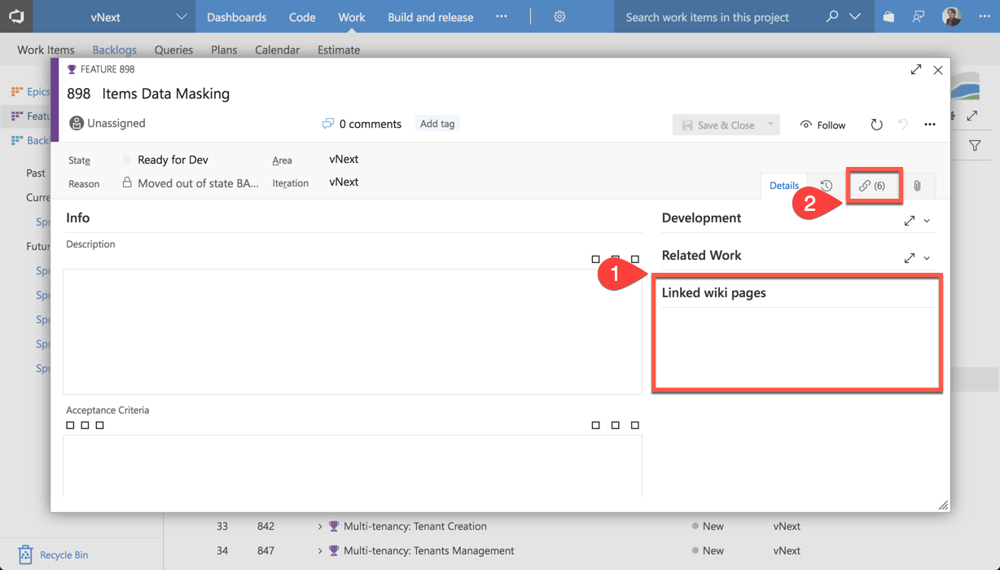
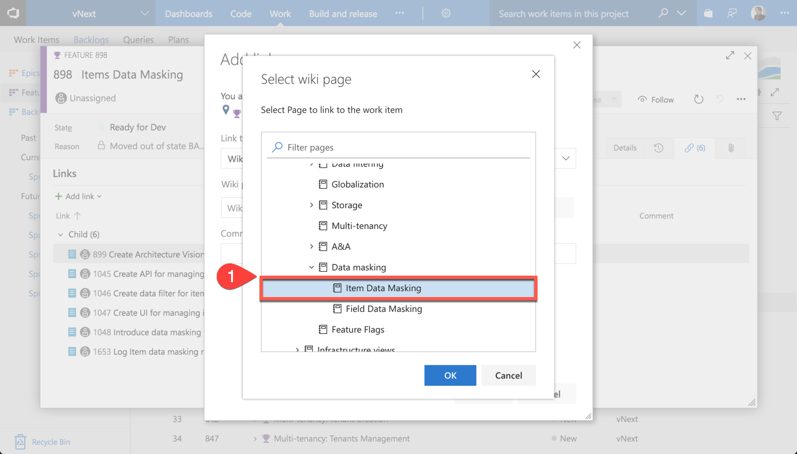
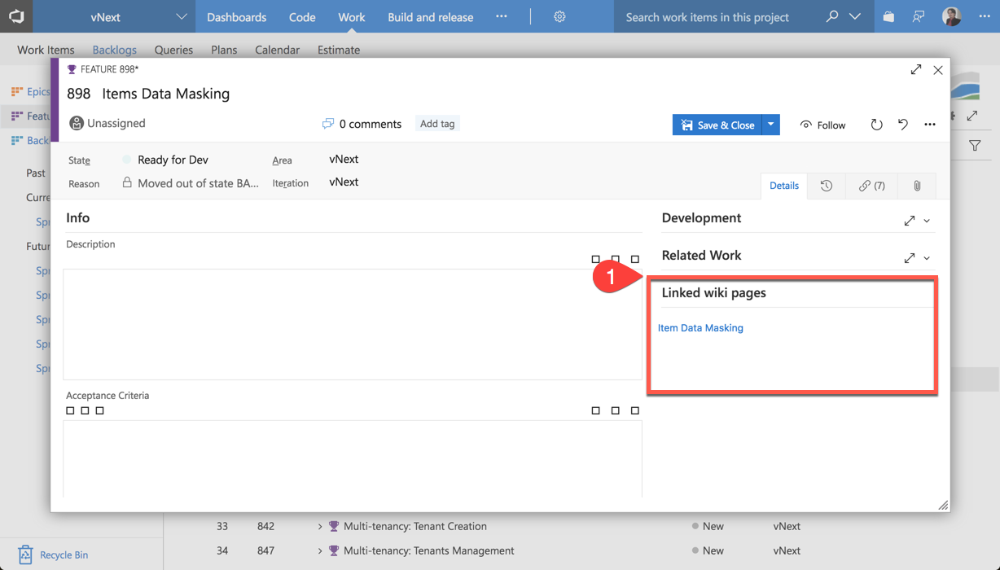

# Link Work Items to Wiki Pages

This extension will add a custom UI control for all Work Item forms. With this UI control you will be able to see all the Wiki Pages that were attached to current Work Item.

### How to install

After you install this extension from Marketplace it will automatically add custom UI control to all Work Item forms, no further configuration required. 

### How to use

#### 1

**1.1.** When you open some Work Item from backlog you will see that there are, probably, no linked Wiki pages yet.  
**1.2.** To link some Wiki pages navigate to `Links` tab of Work Item.  

#### 2

**2.1.** Click on `Add link` to add a new link for current Work Item.  
**2.2.** Choose `Existing Item` to add a link for already existing Wiki page.  

#### 3

**3.1.** Choose `Wiki page` for link type.  
**3.2.** Click on `...` to select Wiki page from tree view.  

#### 4

**4.1.** Choose which Wiki page will be linked to current Work Item. Click `OK`.  

#### 5

**5.1.** Now you can get back to `Details` tab and see that linked Wiki page is displayed inside the `Linked wiki pages` section. You can now save and close your Work Item. When you will open it next time, all linked Wiki pages will be in place.  

